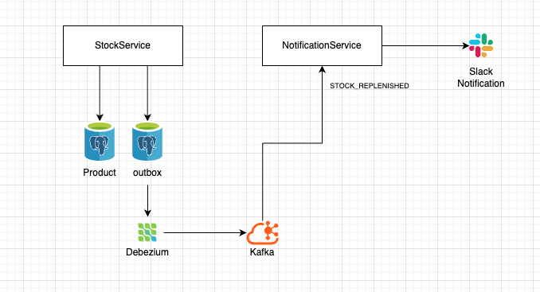

# Stock Replenishment Notifications (Outbox + Debezium + Kafka + Idempotent Consumer)

This repository demonstrates a reliable, event-driven notification flow between two microservices (**stock-service** and **notification-service**) using the **Outbox Pattern**, **Debezium CDC**, and **Kafka**.

The goal is to send a **Slack alert** when a product’s stock transitions from **0 → >0**, while staying resilient to retries, duplicates, and multi-instance consumers.

## Artifacture



---

## Services

### stock-service
- Owns product stock data.
- Detects **stock replenishment** events (**0 → >0**).
- Writes a JSON event to the **outbox** table **within the same DB transaction**.

### notification-service
- Consumes outbox events via **Kafka** (published by Debezium).
- Applies **idempotency + status-based processing**.
- Sends a Slack notification only when appropriate.

---

## High-level Architecture

1. `stock-service` updates stock in the database  
2. **AOP** detects a **0 → >0** transition and writes an **Outbox** record **before commit**  
3. **Debezium** captures the Outbox insert (CDC) and publishes it to **Kafka**  
4. `notification-service` consumes the Kafka message, runs idempotent checks, and sends **Slack**  
5. The event is tracked as processed (**PENDING / SENT / FAILED**) to prevent duplicates and support retries  

---

## Event Production Flow (stock-service)

When `/updateStock` is called and a product previously at **unit=0** is replenished to **unit>0**, the system produces a `STOCK_REPLENISHED` event.

### 1) Intercept repository save
- An AOP aspect intercepts calls to `JpaRepository.save(..)`.

### 2) Read previous stock value
- The aspect queries the database to fetch the previous stock (`oldUnit`).

### 3) Decide whether to write an Outbox event
An outbox record is written only if:
- `oldUnit != null && oldUnit == 0`
- `newUnit != null && newUnit != 0`

### 4) Write Outbox record **before commit**
- If a transaction is active, the aspect registers a `TransactionSynchronization`.
- Inside `beforeCommit`, it builds a JSON payload containing:
  - `eventId` (**UUID**)
  - `eventType = STOCK_REPLENISHED`
  - `brand`, `model`, `category`
  - `beforeTotalStock`, `afterTotalStock`
  - `occurredAt` (**UTC**)
- The payload is stored in the **outbox** table.

### 5) Debezium publishes the Outbox insert
- Debezium watches the outbox table (CDC).
- The insert is converted into a Kafka event and forwarded to `notification-service`.

> **Note:** Writing the outbox record in `beforeCommit` ensures the event is generated only when the DB transaction is about to commit successfully.

---

## AOP Implementation (stock-service)

```java
@Aspect
@Component
@RequiredArgsConstructor
public class StockOutboxAspect {

    private final OutboxService outboxService;
    private final ObjectMapper objectMapper;
    private final ProductJdbcRepository productJdbcRepository;

    @Around("execution(* org.springframework.data.jpa.repository.JpaRepository+.save(..)) && args(entity)")
    public Object around(ProceedingJoinPoint pjp, Object entity) throws Throwable {

        if (!(entity instanceof Product p)) {
            return pjp.proceed();
        }

        Integer newUnit = p.getUnit();
        Integer oldUnit = productJdbcRepository.fetchOldUnitFromDb(p.getId());

        boolean shouldWrite =
                oldUnit != null && oldUnit == 0 &&
                        newUnit != null && newUnit != 0;

        if (shouldWrite && TransactionSynchronizationManager.isActualTransactionActive()) {
            TransactionSynchronizationManager.registerSynchronization(new TransactionSynchronization() {
                @Override
                public void beforeCommit(boolean readOnly) {

                    try {
                        var payload = ProductPayload.builder()
                                .eventId(UUID.randomUUID().toString())
                                .eventType(EventType.STOCK_REPLENISHED)
                                .brand(p.getBrand())
                                .model(p.getModel())
                                .category(p.getCategory().getValue())
                                .beforeTotalStock(oldUnit)
                                .afterTotalStock(p.getUnit())
                                .occurredAt(Date.from(LocalDateTime.now().toInstant(ZoneOffset.UTC)))
                                .build();

                        outboxService.addOutbox(OutboxInput.builder()
                                .payload(objectMapper.writeValueAsString(payload))
                                .build());
                    } catch (Exception e) {
                        throw new RuntimeException();
                    }
                }
            });
        }
        return pjp.proceed();
    }
}
```
## Event Consumption Flow (notification-service)

Once the event arrives via Kafka, the **notification-service** processes it safely and avoids duplicate Slack messages.

### 1. Consume and parse the Kafka message
- The consumer receives the Debezium-produced Kafka message.
- It deserializes the message into `KafkaPayload` and extracts the `eventId`.

### 2. Atomic idempotency gate (UNIQUE `event_id`)
The consumer uses an `event_process` (or `processed_events`) table where `event_id` is **UNIQUE**.

- It attempts to **atomically insert** a new record:
  - `event_id = <eventId>`
  - `status = PENDING`
  - `attempt_count = 0`
  - timestamps (`created_at`, `updated_at`)

Recommended Postgres approach:
- `INSERT ... ON CONFLICT DO NOTHING`

Alternative:
- `UNIQUE constraint + catching duplicate key exceptions`

### 3. Decision based on current status
- **Insert succeeded** → first time this event is seen → proceed.
- **Event already exists** → fetch the status and decide:
  - `SENT` → **skip** (Slack notification already delivered)
  - `PENDING` → **skip** (another instance may be processing, or still in progress)
  - `FAILED` → **retry** (attempt processing again; optionally set back to `PENDING`)

### 4. Send the Slack notification
- If the decision is to process now: `notificationService.sendSlack(...)`

### 5. Mark the event as `SENT` / `FAILED`
- If Slack succeeds:
  - update `status = SENT`
  - set `last_error = null`
  - increment `attempt_count`
  - update `updated_at`
- If Slack fails:
  - update `status = FAILED`
  - store `last_error`
  - increment `attempt_count`
  - update `updated_at`
  - optionally rethrow the exception to trigger Kafka retry/DLT

### 6. Outbox cleanup strategy (after Slack success)
- **Option A: Producer-side TTL cleanup (recommended)**
  - Keep outbox records for a limited time (e.g., 7–30 days).
  - Run a scheduled job in `stock-service` to delete old outbox rows.
- **Option B: Immediate cleanup trigger (coupled)**
  - Call the producer to delete the related outbox record right after Slack succeeds.
